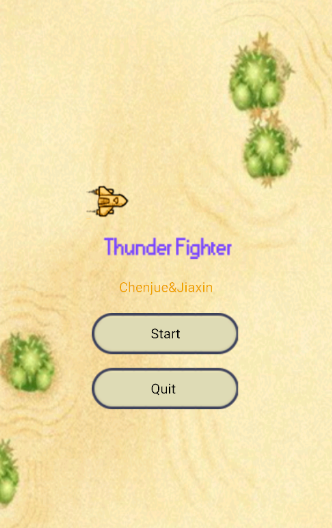
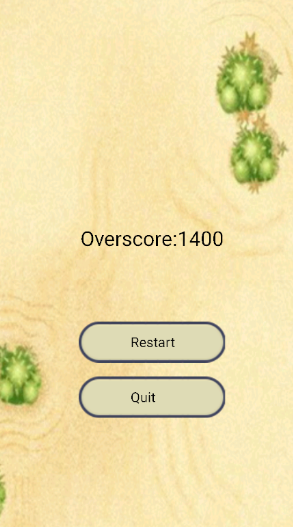
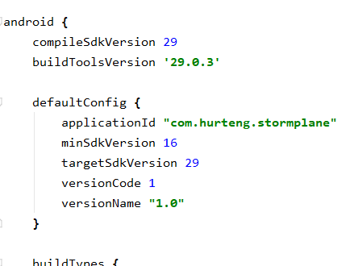

[](https://img.shields.io/badge/platform-win--31%20%7C%20win--64-lightgrey)
[](http://www.apache.org/licenses/)
[](https://www.linkedin.com/in/jiaxin-fan-6aa43918b/)
[](https://www.linkedin.com/in/%E6%B2%89%E7%8F%8F-%E8%A7%A3-39450818b/)
<br />
<p align="center">
  <h3 align="center">SIT305 Assessment2  </h3>
  <p align="center">
    Thunder fighter 
    <br />
    <a href="https://github.com/JiaxinFan/SIT305-Assignment2"><strong>Explore the docs in Git »</strong></a>
    <br />
    <br />
    <a href="https://github.com/JiaxinFan/SIT305-Assignment2/blob/master/Issues">Report Bug</a>
    ·
    <a href="https://github.com/JiaxinFan/SIT305-Assignment2/blob/master/Issues">Request Feature</a>
  </p>
</p>

<!-- TABLE OF CONTENTS -->
## Table of Contents

- [Table of Contents](#table-of-contents)
- [About The Project](#about-the-project)
    - [Index](#index)
  - [Built With](#built-with)
- [Getting Started](#getting-started)
  - [Installation](#installation)
  - [Documentation](#documentation)
- [Acknowledgements](#acknowledgements)
- [Contact](#contact)

<!-- ABOUT THE PROJECT -->
## About The Project

<b>Thunder fighter</b>  (based on Android). You must have played tank battle or airplane battle when you were young. Everyone has memories of childhood. Therefore, based on the original old version of the Thunder fighter, our new version of the game will be smoother and more comfortable. As a game player, you need to control your own aircraft from being hit by local fighters. If you are hit multiple times, you will lose the game qualification. The longer you persist, the more powerful you are.

#### Index
  
```sh
Main interface
``` 
  
```sh
Game page
``` 

```sh
Game Over
``` 
### Built With

This project is mainly built with `Java`, `Android Studio` .
* [Android Studio](https://developer.android.com/reference)
* [Java](https://www.java.com)


<!-- GETTING STARTED -->
## Getting Started

### Installation

1. Clone the repo

```sh
git clone https://github.com/JiaxinFan/SIT305-Assignment2
```

2. Modify the gradle.build (make it same with your laptop version)


3. Start

```sh
 run the app
```

### Documentation

 Documentation file: 
 https://github.com/JiaxinFan/SIT305-Assignment2/blob/master/Documentation.docx


<!-- ACKNOWLEDGEMENTS -->
## Acknowledgements

  * [Android Studio](https://developer.android.com/reference) - The code and UI framework used
  * [NoxPlayer](https://www.yeshen.com/) -Emulator to Emulate real Android phone(Test)
  * [SourceTree](https://www.sourcetreeapp.com/) - The application used in joint development

<!-- CONTACT -->
## Contact

Jiaxin Fan: fanjiax@deakin.edu.au  
Chenjue Xie: xiechen@deakin.edu.au
